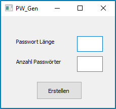

# QR_PW_Generator
simple python password generator - outputs qr codes

Windows (.exe) file can be found here: [PW_Generator_Win](https://drive.google.com/file/d/12AzIXYCP6Utg88PQgyWo4Lwpz8q8SZAZ/view?usp=sharing)

## How to use
1. enter password length
2. enter number of passwords desired
3. click on "Erstellen"
4. select directory folder

## Screenshot

